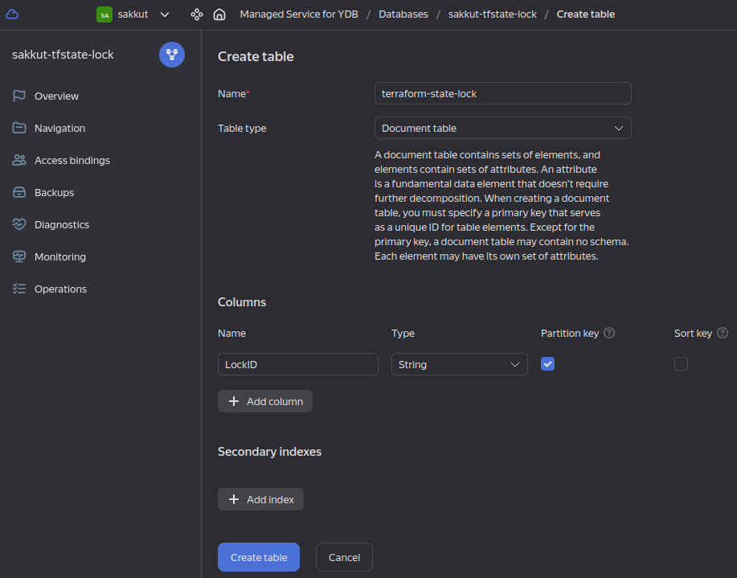

# OpenVPN Server in Yandex Cloud

## YaCloud Preparation
[Useful video tutorial](https://www.youtube.com/live/U58zSIvgyDI?si=bZ9TzHT6OfgyQbk5)

1. Create folder in YaCloud for our resources (use web-interface)

2. Create S3 bucket for terraform state:
```
yc storage bucket create --name sakkut-terraform-state --folder-name sakkut --default-storage-class standard --max-size 2147484672

```

3. Create YDB for storing tf-state lock:
```
yc ydb database create sakkut-tfstate-lock --folder-name sakkut --serverless
```

4. Create table in YDB:


5. Create service account for managing resources in folder & working with terraform state:
```
yc resource-manager folder add-access-binding <folder-ID> --role admin --subject serviceAccount:<serviceAccount-ID>
yc resource-manager folder add-access-binding <folder-ID> --role ydb.editor --subject serviceAccount:<serviceAccount-ID>
yc resource-manager folder add-access-binding <folder-ID> --role storage.editor --subject serviceAccount:<serviceAccount-ID>
yc iam access-key create --service-account-name sa-sakkut-subadmin --folder-name sakkut
```
Output of last command must be like:
```
access_key:
  id: <access_key_ID>
  service_account_id: <serviceAccount-ID>
  created_at: "2024-02-04T02:04:24.000000000Z"
  key_id: <key_id>
secret: <secret>
```

6. Create SA key for YaCloud CLI:
```
yc iam key create --service-account-id <serviceAccount-ID> --folder-name sakkut --algorithm rsa-4096 --output ~/.config/yandex-cloud/key.json
yc config set service-account-key ~/.config/yandex-cloud/key.json
yc config set cloud-id <cloud-id>
yc config set folder-id <folder-ID>
```

7. Configure SA for terraform via AWS CLI:
```
aws configure
```
and enter values for AWS Access Key ID & AWS Secret Access Key:
```
AWS Access Key ID [None]: <key_id>
AWS Secret Access Key [None]: <secret>
Default region name [None]: 
Default output format [None]:
```

8. Create VM for VPN Server:
```
terraform validate
terraform plan
terraform apply
```

9. Configure OpenVPN:
```
ansible-playbook -i inventories/sandbox/hosts applyRole.yaml --vault-password-file ../vault.key
```
Client .ovpn-files stored in /etc/openvpn/client/*vpnClients.clientName*/client.ovpn

10. Delete VM after all:
```
terraform destroy
```
